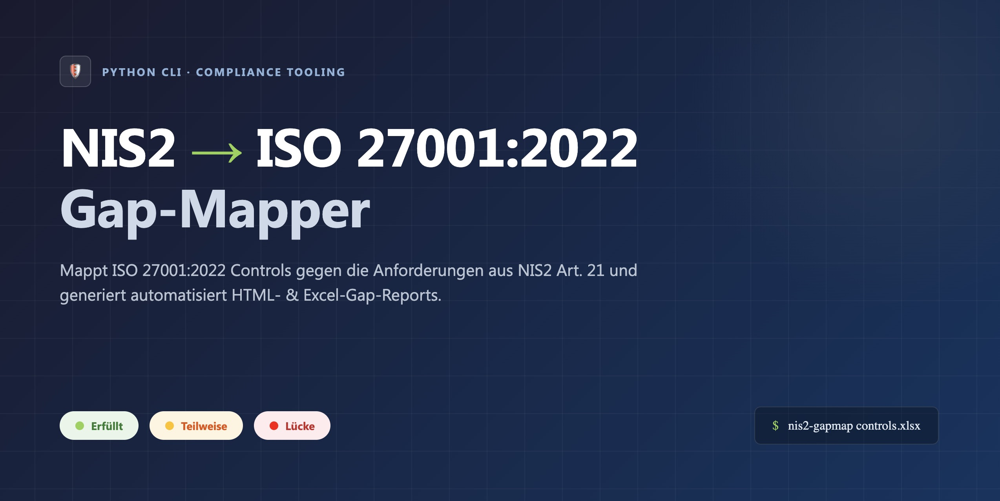
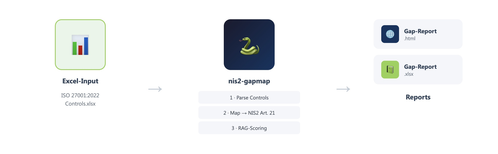
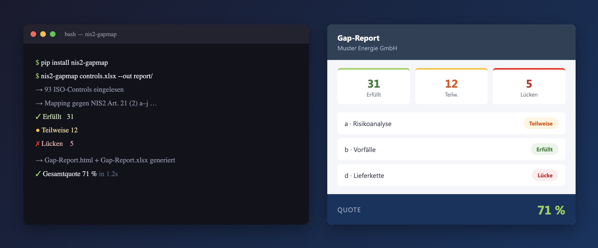

# NIS2 → ISO 27001:2022 Gap-Mapper

CLI-Tool zur automatisierten Lückenanalyse zwischen den NIS2-Anforderungen (Art. 21) und dem Umsetzungsstatus der ISO 27001:2022 Annex-A-Controls.

---

## Wie es funktioniert



---

## Demo



---

## Voraussetzungen

- Python 3.10+
- pip

## Installation

```bash
pip install -r requirements.txt
```

## Verwendung

### 1. Beispieldatei erzeugen

```bash
python create_sample.py
```

Erstellt `sample_input/controls_sample.xlsx` mit 17 vorbefüllten Controls.

### 2. Gap-Report generieren

```bash
python mapper.py --input sample_input/controls_sample.xlsx --output output/
```

### Ausgabe

| Datei | Beschreibung |
|---|---|
| `output/gap_report.html` | Visueller Report mit RAG-Badges |
| `output/gap_report.xlsx` | Excel mit farbcodierten Zellen |

## Input-Format (controls_status.xlsx)

| Spalte | Pflicht | Beschreibung |
|---|---|---|
| `control_id` | Ja | ISO 27001:2022 Nummerierung, z. B. `5.1`, `8.24` |
| `control_name` | Nein | Name des Controls (wird aus internem Dict befüllt wenn leer) |
| `status` | Ja | `Umgesetzt` / `Teilweise` / `Nicht umgesetzt` |
| `notes` | Nein | Freitext-Notizen |
| `responsible` | Nein | Verantwortliche Person / Team |

## Scoring-Logik

| RAG | Bedingung |
|---|---|
| ✓ Erfüllt (grün) | **Alle** gemappten Controls = „Umgesetzt" |
| ~ Teilweise (gelb) | **Mindestens eines** = „Umgesetzt" oder „Teilweise" |
| ✗ Lücke (rot) | **Kein** Control umgesetzt |

## NIS2-Mapping

10 Anforderungen aus Art. 21 Abs. 2 NIS2-Richtlinie, gemappt auf insgesamt 50+ ISO-27001:2022-Controls (Annex A).

## Dateistruktur

```
nis2-iso27001-mapper/
├── mapper.py              
├── mapping_data.py        
├── create_sample.py       
├── requirements.txt
├── assets/                # Bilder für README
├── templates/
│   └── report.html.j2    
├── sample_input/
│   └── controls_sample.xlsx
└── output/                # Generierte Reports (gitignored)
```
